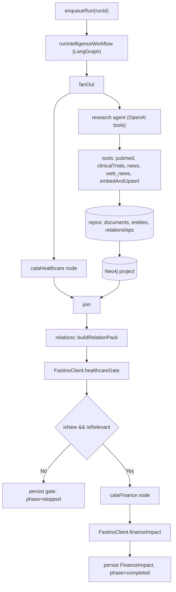

## Developer 2 - agents, ingestion, and graph pipeline

Implements the `POST /runs` agent flow from [planning.md](planning.md) and [docs/superpowers/plans/2026-08-29-healthcare-market-intelligence.md](docs/superpowers/plans/2026-08-29-healthcare-market-intelligence.md) as a tested vertical slice. External services sit behind interfaces (real HTTP impl + mock) so tests never need live keys.

### Decisions locked in
- Cala: real client to `POST https://api.cala.ai/v1/knowledge/query` (`X-API-KEY`); healthcare vs finance are two query strings. Behind `CalaClient` interface + `MockCalaClient`.
- Fastino: `FastinoClient` interface with an OpenAI-backed impl now (`gpt-5.6-luna` + JSON schema), swap to a real Fastino endpoint later. `MockFastinoClient` for tests.
- Scope: PubMed + ClinicalTrials + news/IR adapters; full run graph; Neo4j projection.
- Follow-on ingestion: Tavily `web_news` (`search_web_news`) is a research adapter (title + snippet + URL). Fastino Healthcare still has no search tool.
- Credentials in gitignored `.env` (`OPENAI_API_KEY`, `CALA_BASE_URL`, `CALA_API_KEY`, `NEO4J_*`, `NEWS_FEED_URL`, `TAVILY_API_KEY`), placeholders in `.env.example`.

### Architecture

### Dependency injection
`runIntelligenceWorkflow(runId, deps)` takes `deps = { cala, fastino, openai, repos, graph, tools }`. Defaults wire real implementations; tests pass mocks + in-memory repos. This is what makes "does it work" testable without Postgres/Neo4j/live APIs.

### Work breakdown

1. Install + baseline: `pnpm install`; add deps (`openai`, `@langchain/langgraph`, `@langchain/core`, `neo4j-driver`, `zod`, `tsx`) to the relevant packages; confirm `pnpm typecheck` and `pnpm test` green on the current scaffold.

2. Contracts + schema (extend, approved): in [packages/contracts/src/index.ts](packages/contracts/src/index.ts) add `CalaEntity`, `CalaSnapshot`, `HealthcareGate`, `FinanceImpact`, `ExpectedImpact`, `RelationPack`; add `phase` to `AgentRun`. In [packages/db/src/schema.ts](packages/db/src/schema.ts) add `cala_snapshots`, `healthcare_gates`, `finance_impacts` tables; run `drizzle-kit generate` for a new migration. Add repo interfaces + in-memory impls for documents, entities, relationships, snapshots, gates, finance impacts (reusing existing in-memory repos); provide Drizzle-backed writes for `source_documents`, `cala_snapshots`, `healthcare_gates`, `finance_impacts` for real runs.

3. `@cala/ingestion`: `types.ts` (`NormalizedDocument`, `SourceAdapter`, `SourceContext`), `normalize.ts` (`contentHash`, text normalize), `sources/{pubmed,clinical-trials,news}.ts` (explicit timeouts, provider IDs, provider-scoped errors). Tests use captured JSON fixtures; no live keys.

4. `@cala/agents`:
   - `models.ts` (OpenAI chat + embeddings, env).
   - `cala.ts` (`CalaClient`, `HttpCalaClient`, `MockCalaClient`; `healthcareQuery`/`financeQuery` builders).
   - `fastino.ts` (`FastinoClient` interface, `OpenAIFastinoClient`, `MockFastinoClient`; zod schemas for `HealthcareGate` and `FinanceImpact`).
   - `tools.ts` (LangChain tools wrapping adapters + `embed_and_upsert`).
   - `research.ts` (OpenAI tool-calling agent -> writes documents/entities via repos).
   - `relations.ts` (`buildRelationPack` from graph neighborhood).
   - `workflow.ts` (LangGraph `StateGraph`: fanOut -> join -> relations -> healthcareGate -> conditional finance).
   - `deps.ts` (default wiring).

5. `@cala/graph`: `client.ts` (neo4j driver + fake for tests), `project.ts` (`projectEntity`/`projectRelationship` idempotent `MERGE` on Postgres ids), `queries.ts` (`neighborhood`).

6. Worker + API wiring: [apps/worker/src/index.ts](apps/worker/src/index.ts) `enqueueRun(runId)` runs the workflow fire-and-forget, updating `agent_runs.phase`/`status`; `scheduler.ts` minimal daily delta. Wire [apps/api/src/routes/runs.ts](apps/api/src/routes/runs.ts) `enqueueRun` to the worker at app startup (keep the stub for existing API tests).

### Tests / verification
- `packages/ingestion/src/sources/*.test.ts`: each adapter parses its fixture into a `NormalizedDocument`; `normalize.test.ts` for stable `contentHash`.
- `packages/agents/src/workflow.test.ts` (mocks + in-memory repos): (a) Cala healthcare and research run in parallel and Cala finance is NOT called before the gate; (b) gate `{isNew:true,isRelevant:false}` stops with no finance; (c) gate `{isNew:true,isRelevant:true}` calls Cala finance + Fastino finance and persists `FinanceImpact`; (d) one failing tool is recorded and does not abort the Cala branch.
- `packages/agents/src/fastino.test.ts`: `OpenAIFastinoClient` parses/validates structured output (mocked OpenAI response) against the zod schema.
- `packages/graph/src/project.test.ts` (fake driver): projecting the same relationship twice issues one idempotent `MERGE`; optional integration test gated on `NEO4J_URI`.
- `scripts/run-moderna.ts` (manual, gated on real keys): live end-to-end run for Moderna to eyeball the gate + finance output. Not part of `pnpm test`.
- Gate: `pnpm typecheck && pnpm test` green; docker compose up for the live script only.

### Notes / follow-ups (out of scope this pass)
- Tavily `web_news` is now in the research tool list; Fastino Healthcare still must not call search.
- Patents/FDA/DailyMed/SEC adapters, people/institution entity linking, and momentum-report synthesis are deferred (documented as next adapters/PRs).
- Full Drizzle migration of Developer 1's in-memory `companies`/`runs` repos stays with Developer 1; I only add DB-backed writes for tables the pipeline touches.
- Exact Cala DSL for healthcare/finance queries will be tuned against the live API during step 4; the client stays generic (`query(input)`).