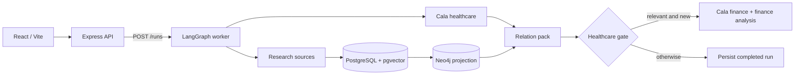

# Cala x OpenAI

We built Predict around the Moderna melanoma-vaccine story: the market-moving announcement was not an isolated event, but the visible end of a longer, evidence-backed sequence. The goal is to surface those connections earlier—before the story becomes obvious in the news.

## What is in the repository

- A React 19 + Vite dashboard for company records, company reports, and an interactive knowledge graph.
- An Express API that exposes companies, runs, graph data, reports, and health checks.
- A LangGraph workflow that runs Cala healthcare intelligence and source research in parallel, builds a relation pack, evaluates a healthcare gate, and only then performs the finance branch when the gate is positive.
- PostgreSQL with pgvector as the canonical store and Neo4j as a rebuildable graph projection.
- Source adapters for PubMed, ClinicalTrials.gov, RSS/news feeds, and Tavily web-news snippets.

## Architecture



`POST /runs` queues work and returns immediately. The UI can poll the run and event endpoints while the worker progresses through fan-out, relations, healthcare gate, and (when applicable) finance.

## Quick start

### Prerequisites

- A current Node.js LTS release
- pnpm 9.15.0 (the version pinned in `package.json`)
- Docker Desktop, for PostgreSQL/pgvector and Neo4j

### Start the local stack

```powershell
corepack enable
pnpm install
Copy-Item .env.example .env
pnpm db:up
pnpm db:migrate
pnpm dev
```

`pnpm dev` starts the API, scheduled worker, and frontend together. With the default configuration:

| Service | Address |
| --- | --- |
| Web dashboard | http://localhost:5173 |
| API | http://localhost:3002 |
| API health | http://localhost:3002/health |
| Neo4j Browser | http://localhost:7474 |
| PostgreSQL | `localhost:15432` |

The dashboard is served at `/`; the interactive graph is at `/knowledge-graph`, and company details are at `/companies/:companyId`.

### Configure integrations

`.env.example` contains the local database defaults and optional provider variables. Add the keys needed for the data sources and model-backed analysis you want to enable:

```dotenv
OPENAI_API_KEY=
CALA_API_KEY=
HF_TOKEN=
TAVILY_API_KEY=
NEWS_FEED_URL=
```

`OPENAI_CHAT_MODEL` defaults to `gpt-5.6-luna`; embeddings default to `text-embedding-3-small`. A missing Tavily key or RSS feed simply leaves that optional source empty.

## Everyday commands

```powershell
pnpm dev          # API, worker, and web app
pnpm dev:web      # Vite dashboard only
pnpm dev:api      # Express API only
pnpm dev:worker   # Daily scheduler only
pnpm db:up        # Start PostgreSQL and Neo4j
pnpm db:migrate   # Apply Drizzle migrations
pnpm typecheck    # Type-check all workspaces
pnpm test         # Run workspace tests
```

## API surface

| Area | Endpoints |
| --- | --- |
| System | `GET /health` |
| Companies | `GET/POST /companies`, `GET /companies/:id`, timeline, people, developments, agent runs, and output sub-resources |
| Runs | `POST /runs`, `GET /runs/:id`, `GET /runs/:id/events` |
| Knowledge graph | `GET /knowledge-graph`, `GET /knowledge-graph/entities/:id`, `POST /knowledge-graph/sql` |
| Reports | `GET /reports/momentum/:companyId` |

The graph SQL endpoint generates and executes read-only queries; it never accepts Cypher from a client.

