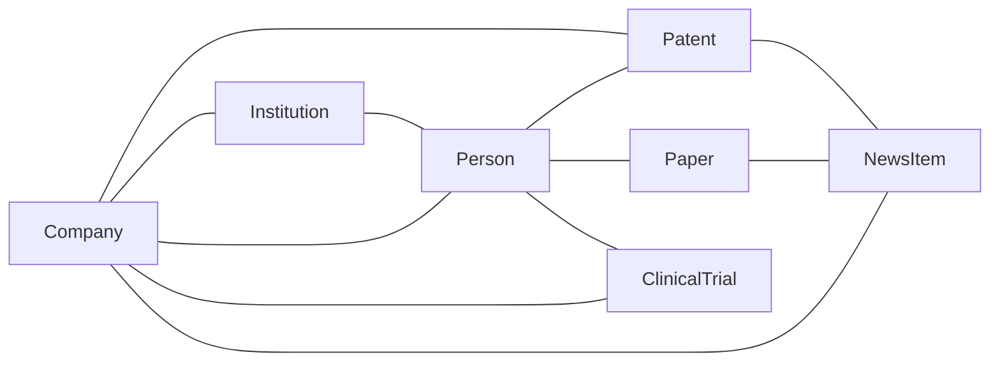
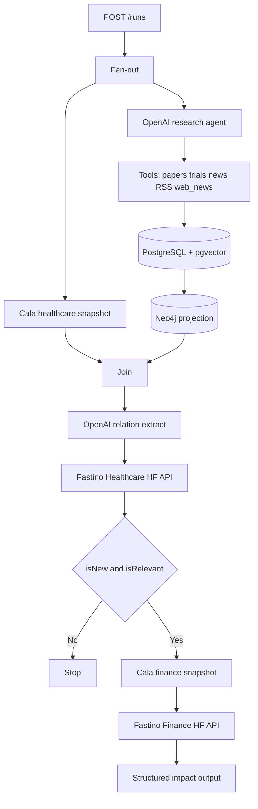

# CALA X OPENAI HACKATHON

## Project

Build a local-first healthcare market-intelligence dashboard whose primary artifact is a **knowledge graph of the healthcare world**, not a company-only watchlist. The graph links companies, people (employees and researchers), scientific papers, patents, clinical trials, healthcare news, and university research departments so a healthcare-and-finance specialized LLM can infer relationships and possible investments **before** the market fully prices a catalyst.

The product thesis: a public announcement that moves a stock is rarely independent. It sits on a trail of patents, papers, collaborations, acquisitions, trial registrations, and disclosures. The dashboard reconstructs that trail and produces a **momentum report** for a company.

### Practical case (demo narrative)

Moderna recently announced an RNA-based cancer vaccine that stops melanoma from returning. The announcement made their stock price skyrocket. That event is not independent: there should be a history of patent filings, company reports, scientific papers, collaborations with research groups, and/or acquisitions of smaller companies. With that history we track and build a **momentum report** for a given company to infer whether they might be pushing out a new product so we can invest before the broader stock-market reaction.

The seeded demo walks this Moderna / melanoma / mRNA-vaccine path end to end.

## Scope

### Graph entities (MVP)

Seed and keep current:

| Node type | MVP seed / source | Notes |
| --- | --- | --- |
| Company | 20 important healthcare/biotech companies; Moderna first in the UI | Unlimited additional companies may be added |
| Person | Extracted from papers, patents, trials, news, and filings | Employees, inventors, investigators, executives, academic authors |
| Institution | University research departments, labs, hospitals extracted from affiliations | Seed well-known orgs that appear on papers/patents tied to the 20 companies |
| Paper | PubMed / PMC | First-class node, not only a company attachment |
| Patent | PatentsView (USPTO) or equivalent patent API | Filing and grant dates matter for momentum |
| ClinicalTrial | ClinicalTrials.gov | Sponsor, collaborators, investigators |
| NewsItem | Company IR/news plus healthcare trade news | Announcements, collaborations, acquisitions |

Relationships are evidence-backed (URL, source document id, confidence). Typical edges: `WORKS_AT`, `AFFILIATED_WITH`, `AUTHORED`, `INVENTOR_OF`, `ASSIGNEE`, `SPONSORS`, `INVESTIGATOR`, `COLLABORATES_WITH`, `ACQUIRED`, `MENTIONS`, `CITES`, `EVIDENCED_BY`.



### Sources

- Seed each source with the prior 12 months of material (longer lookback allowed for patents and landmark papers when needed for the Moderna narrative).
- Daily runs fetch deltas only.
- Live APIs and feeds:
  - ClinicalTrials.gov
  - PubMed and PMC
  - USPTO / PatentsView (patents)
  - FDA: drugs, biologics, and press releases
  - DailyMed
  - SEC EDGAR filings
  - Company investor-relations and news feeds
  - Healthcare news (trade/RSS sources configured in env; no scrape of paywalled bodies)
  - Open-web news via Tavily (`search_web_news`, `TAVILY_API_KEY`): title + snippet + URL only; do not scrape paywalled bodies
- Query Cala twice per qualifying run: a **healthcare/company-intel** snapshot in parallel with the research agent, and a **finance** snapshot only after Fastino Healthcare says the research is new and relevant.

People and institutions are **not** ingested from LinkedIn or university website crawls in MVP. They are resolved from structured fields (authors, inventors, affiliations, sponsors, named entities in news/filings).

### Product pages

```text
Knowledge graph (/)                         # default page
├── Type and company filters
├── Node / edge / path detail
└── Evidence URL and confidence
Companies (/companies)
└── Company detail (/companies/:companyId)
    ├── Momentum summary
    ├── Timeline of papers, patents, trials, news
    ├── People and institutions
    └── Agent runs
People (/people/:personId)
Institutions (/institutions/:institutionId)
Reports (/reports)
├── Company momentum report (/reports/momentum/:companyId)
└── Daily cross-entity briefing (/reports/:reportId)
```

- Primary navigation: Knowledge graph, Companies, Reports.
- A persistent **Run now** action starts the same workflow as the daily scheduler.
- MVP has one local demo operator: no authentication, organizations, or settings page.

## Architecture

This section is the source of truth for **agents and data extraction**. Dashboard pages remain as specified above; they are not part of the run graph.

```text
POST /runs (202, worker continues)
        │
        ├── parallel A: Cala healthcare / company-intel snapshot
        └── parallel B: OpenAI research agent + tools
                         └── write documents, entities, embeddings
                             to PostgreSQL, then project Neo4j
        │
        ▼
OpenAI relation agent reads company neighborhood
(PostgreSQL canonical + Neo4j read model)
        │
        ▼
Fastino Healthcare (Hugging Face Inference)
        │
        ├── isNew && isRelevant? ── no ──► stop (persist gate, no Cala finance)
        └── yes
              ├── Cala finance snapshot
              └── Fastino Finance (Hugging Face Inference)
                    └── structured financial-impact output
```



### Backend (run boundary)

- TypeScript throughout.
- `POST /runs` inserts an `agent_runs` row and returns immediately. It must not wait for Cala, tools, or Fastino.
- LangGraph is the sole agent/workflow framework. It owns parallelism, retries, checkpoints, and the healthcare gate.
- PostgreSQL is the source of truth. Neo4j is a rebuildable projection written only by the worker after Postgres commits — never by HTTP routes.
- Ingestion is idempotent: provider identifiers and content hashes prevent duplicate analysis.
- Entity linking is idempotent: stable external ids (PMID, NCT, patent number, ticker) merge; people/institutions merge on normalized name plus affiliation/company when confidence is high.
- A local scheduler may enqueue the same workflow as Run now.

### Run graph (Developer 2)

**1. Fan-out (parallel, same `runId` and `companyId`)**

| Branch | Owner in code | Writes |
| --- | --- | --- |
| Cala healthcare | Cala client | `cala_healthcare_snapshots` (company profile / healthcare intel from Cala, raw payload + normalized text) |
| Research agent | OpenAI tool-calling agent | `source_documents`, `entities`, `relationships`, embeddings; then Neo4j projection |

The research agent uses OpenAI chat + tool calls. **Tool list is not frozen**; MVP starts with one tool per source adapter below. Add, drop, or merge tools in a follow-up without changing the run graph.

### Implemented on `mauro/dev2-agents-pipeline`

Shipped and tested (mocks; no live keys required for `pnpm test`):

- Source adapters: PubMed, ClinicalTrials.gov, IR/RSS news (`NEWS_FEED_URL`), Tavily web news (`TAVILY_API_KEY`, snippets only)
- Research currently **runs every tool sequentially** in `runResearch` (not LLM tool-picking yet); a failed tool is recorded and does not abort siblings or Cala
- LangGraph: parallel Cala healthcare + research → relation pack → Fastino healthcare gate (`isNew && isRelevant`) → optional Cala finance + Fastino finance
- Fastino clients are OpenAI JSON-schema stand-ins today (`OpenAIFastinoClient`); swap to Hugging Face later without changing the graph
- Worker `enqueueRun` + `scripts/run-moderna.ts` demo
- Deferred: patents, FDA, DailyMed, SEC, people/institution linking, dashboard UI, real Fastino HF endpoints

Initial research tools (each wraps an ingestion adapter, timeout, provider-scoped errors):

- `search_pubmed` / PMC
- `search_patents` (PatentsView or equivalent) — deferred
- `search_clinical_trials`
- `search_fda` — deferred
- `search_dailymed` — deferred
- `search_sec` — deferred
- `search_news` (IR + healthcare RSS/JSON feeds)
- `search_web_news` (Tavily; title + snippet + URL; Fastino Healthcare does **not** call search)
- `embed_and_upsert` (OpenAI embeddings into pgvector)

The agent decides which tools to call for the company and `mode` (`seed` | `delta`). Failed tools are recorded on the run and do not abort the sibling Cala branch or other tools.

**2. Join, then relation extract**

After both branches finish (or one fails and is recorded), an OpenAI structured-output step reads the company neighborhood from PostgreSQL (canonical) and Neo4j (read model). It produces a compact relation pack: new nodes/edges vs prior graph, evidence ids, and a research brief for Fastino. It must not invent patents, papers, or trials that are not in the stores.

**3. Fastino Healthcare gate**

Call [Fastino-Nemotron-3.5-Lightning-Healthcare](https://huggingface.co/fastino/Fastino-Nemotron-3.5-Lightning-Healthcare) via **Hugging Face Inference** (OpenAI-compatible chat completions + `HF_TOKEN`). Do not load the 30B merged checkpoint in local Docker for MVP.

Input: Cala healthcare snapshot + relation pack + research documents (truncated). Output (structured JSON parsed from the model, with a JSON-schema repair pass via OpenAI if needed):

```ts
type HealthcareGate = {
  isNew: boolean;
  isRelevant: boolean;
  relevanceScore: number; // 0-1, ranking only
  rationale: string;
  developmentSummary: string;
};
```

**Continue to process 2 only if `isNew && isRelevant`.** Otherwise persist the gate and mark the run completed without finance.

**4. Process 2 — Cala finance + Fastino Finance**

Fetch Cala **finance** history/fundamentals for the company. Call [Fastino-Nemotron-3.5-Lightning-Finance](https://huggingface.co/fastino/Fastino-Nemotron-3.5-Lightning-Finance) via Hugging Face Inference with: gate `developmentSummary`, relation pack, and Cala finance snapshot.

Structured output (example: they could release a vaccine because of papers/patents/trials X, Y, Z):

```ts
type FinanceImpact = {
  developmentSummary: string;
  potentialProductOrCatalyst: string;
  expectedImpact: {
    direction: 'up' | 'down' | 'unclear';
    magnitude: 'low' | 'medium' | 'high';
    horizon: string;
    confidence: number;
  };
  rationale: string;
  evidenceIds: string[];
};
```

Persist as `finance_analyses`. Optional OpenAI step may turn the same evidence ids into a **momentum report** narrative; it must not add events absent from Postgres.

### Model architecture

| Role | Model | How it is called |
| --- | --- | --- |
| Research agent (tool calling) | OpenAI chat (default `gpt-5.6-luna`) | LangGraph tool node |
| Relation extract / JSON repair | OpenAI chat + structured outputs | After graph write |
| Embeddings | OpenAI embeddings (e.g. `text-embedding-3-small`) | pgvector on documents and entities |
| Healthcare gate | Fastino Nemotron 3.5 Lightning Healthcare | Hugging Face Inference API |
| Finance impact | Fastino Nemotron 3.5 Lightning Finance | Hugging Face Inference API |
| Market / company data | Cala | Healthcare snapshot in parallel; finance snapshot only after gate |

Env: `OPENAI_API_KEY`, `HF_TOKEN`, `CALA_*`, `NEWS_FEED_URL`, `TAVILY_API_KEY`, `FASTINO_HEALTHCARE_MODEL`, `FASTINO_FINANCE_MODEL`. Fastino weights stay on Hugging Face; this app is an API client. Missing `TAVILY_API_KEY` skips web news (empty result), same as a missing IR feed.

### Data stores

PostgreSQL is the source of truth and has pgvector enabled.

| Area | Tables |
| --- | --- |
| Directory | `companies`, `people`, `institutions`, `company_sources` |
| Ingestion | `ingestion_runs`, `source_documents` |
| Graph (canonical) | `entities`, `relationships`, `document_entities` |
| Agent output | `agent_runs`, `cala_healthcare_snapshots`, `cala_finance_snapshots`, `healthcare_gates`, `developments`, `finance_analyses`, `momentum_reports`, `daily_reports` |
| Retrieval | OpenAI embeddings on `source_documents` and `entities` |

`source_documents` retain provider URL/identifier, publication or filing time, raw payload, normalized text, content hash, and optional company link. Documents may attach to people and institutions as well as companies.

Neo4j is a derived read model, never a competing source of truth. It stores curated entities, evidence-backed relationships, and links to PostgreSQL records. It can be rebuilt from PostgreSQL after a schema change or failed projection.

### API contract

```text
GET    /knowledge-graph?companyId=&types=&personId=&institutionId=
GET    /companies
POST   /companies
GET    /companies/:id
GET    /companies/:id/timeline
GET    /companies/:id/people
GET    /people/:id
GET    /institutions/:id
GET    /companies/:id/documents
GET    /companies/:id/developments
GET    /companies/:id/agent-runs
POST   /runs                     # { companyId, mode: seed | delta } — 202 queued
GET    /runs/:id                 # status, phase, errors, counts (cala, docs, gate, finance)
GET    /reports
GET    /reports/:id
GET    /reports/momentum/:companyId
```

`POST /runs` returns a run ID immediately. The frontend polls `GET /runs/:id` for progress and errors. No route accepts Cypher.

### Local infrastructure

```text
Docker Compose
├── postgres:16 + pgvector
├── neo4j
├── api       # Express / TypeScript
└── worker    # LangGraph / TypeScript
```

The React/Vite frontend uses Tailwind CSS and native React/HTML components for the dashboard. React Flow is the sole UI library in the MVP, used only for the knowledge graph. `.env` holds OpenAI, Hugging Face, Cala, and source keys. No Supabase, Redis, cloud scheduler, hosted PostgreSQL, or authentication in MVP. Do not run Fastino weights inside Compose.

## Non-goals and upgrade triggers

- No Redis or queue service initially. Add one when concurrent runs or retries outgrow the in-process worker.
- No hosted deployment or managed database for the initial local demo.
- No graph database as a source of truth. Neo4j becomes independently writable only if graph operations become the product's primary write path.
- No user authentication or per-user graphs until the demo evolves beyond a single operator.
- No LinkedIn, full-web crawl, or paywalled news body extraction in MVP.
- No general-purpose Q&A chat over the graph in MVP.
- No local GPU serving of Fastino checkpoints in MVP; use Hugging Face Inference.
- Research tools may change; the fan-out → gate → optional finance graph must not.
